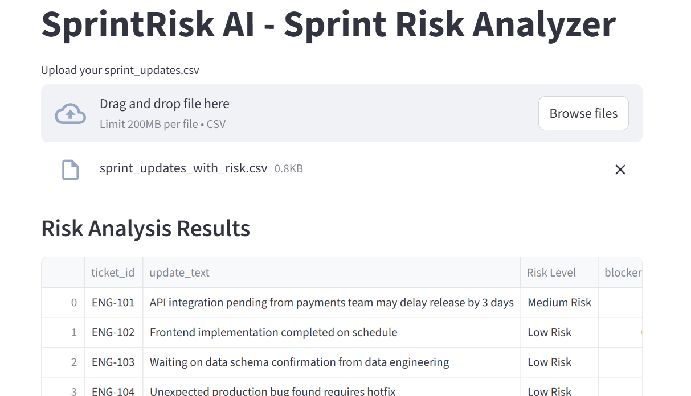
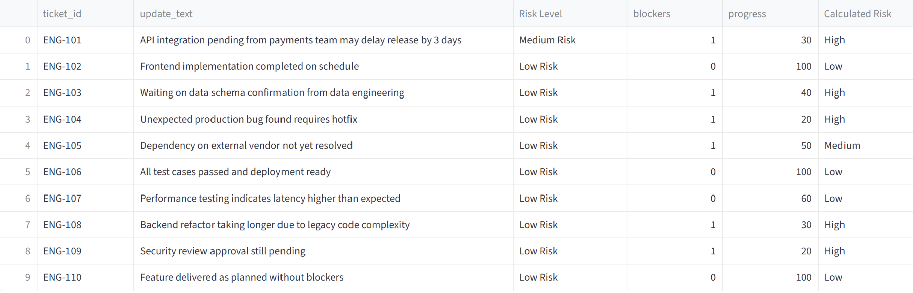
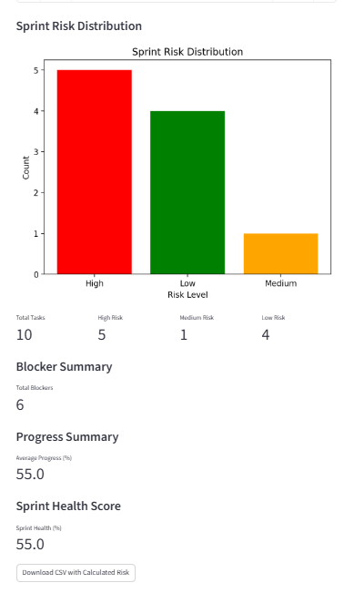

# AI Sprint Risk Analyzer 🚀

Live App:  
https://ai-sprint-risk-analyzer-jcqfd4z4habsx6uuactvep.streamlit.app/

---

## Overview
SprintRisk AI is a **flexible, universal Streamlit app** for sprint risk analysis. It allows project managers to upload **any CSV file**, map columns, and analyze sprint risks across tasks, blockers, and progress metrics. The app calculates risk levels, generates visual dashboards, and provides actionable insights, regardless of dataset structure.

---

## 📊 Dashboard Preview

### Sprint Risk Dashboard


### Progress Metrics Summary


### Risk Distribution Graph


---

## 🎯 Key Features

✅ Upload **any CSV file** (from Jira, Excel, or custom sprint trackers)  
✅ Flexible **column mapping** for Ticket ID, Task Description, Blockers, and Progress  
✅ Optional fields: blockers and progress can be omitted  
✅ Automatic risk detection: High / Medium / Low  
✅ Risk distribution visualization  
✅ Blocker tracking  
✅ Sprint health score calculation  
✅ Progress monitoring  
✅ Download CSV with calculated risk

---

## 🧠 How Risk Is Calculated

Risk levels are determined using **task progress** and **blockers**:

* **High Risk** → Blockers present **AND** progress below 50%  
* **Medium Risk** → Blockers present **OR** progress below 50%  
* **Low Risk** → No blockers **AND** progress ≥ 50%  

Sprint Health Score is calculated based on:

* Low Risk Tasks → High contribution  
* Medium Risk Tasks → Moderate contribution  
* High Risk Tasks → Low contribution  

This produces an overall percentage showing sprint stability.

---

## 🛠️ How to Map Your Columns

When uploading a CSV, the app will prompt you to map:

| Field | Description |
|-------|-------------|
| Ticket ID | Unique task identifier (Task ID, Issue ID) |
| Update Text | Task description (Summary, Title, Task Name) |
| Blockers | Number of blockers (optional) |
| Progress | Task completion percentage (optional) |

**Notes:**

- If blockers or progress are missing, the app will use default values:  
  * Blockers = 0  
  * Progress = 50%  

- This ensures analysis and graphs remain accurate for any dataset.

---

## 📂 Sample Input Format

Example CSV structure:

```csv
ticket_id,progress,blockers
ENG-101,40,1
ENG-102,90,0
ENG-103,60,0


---

## 📈 Sprint Metrics Included

The dashboard calculates:

- Total Tasks  
- High Risk Tasks  
- Medium Risk Tasks  
- Low Risk Tasks  
- Total Blockers  
- Average Progress (%)  
- Sprint Health Score (%)

---

## ⚙️ Technologies Used

- Python  
- Pandas  
- Matplotlib  
- Streamlit  
- PIL (Python Imaging Library)

---

## ▶️ How to Run Locally

Step 1 — Install dependencies:
pip install streamlit pandas matplotlib pillow
Step 2 — Run the app:
streamlit run sprintrisk_app.py

---

## 🚀 Future Enhancements

- Smart column auto-detection  
- NLP-based risk analysis  
- Jira API integration  
- Predictive sprint risk modeling  
- Multi-project dashboards  

---

## 👤 Author

**Kathy Raina**  
AI & Product-Focused Project Developer
